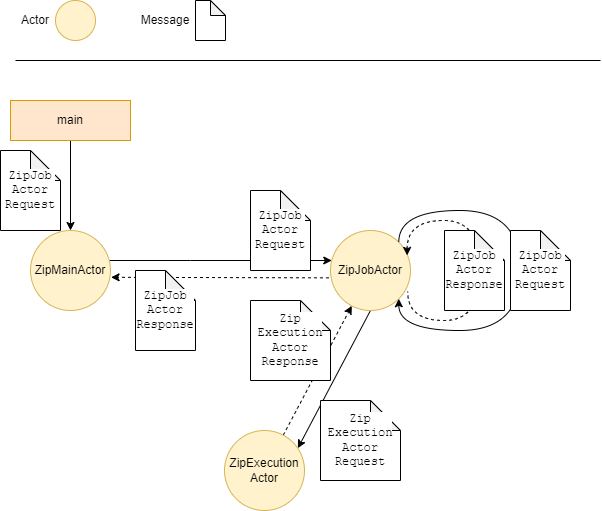

= actor-model-showcases
:toc:

== Purpose: It's a showcase

This project is a showcase.

It shows how to execute a _hierarchical_ zip-job with different frameworks with as much parallelism as possible:

* Akka (Java) https://akka.io/
* actor4j https://actor4j.io/ (pending)
* StructuredTaskScope (Java 19) 

_Hierarchical_ zip-job means: You can define a zip-job which might include the creation of nested *.zip-files (matryoshka-style). 

== Intention and motivation

This showcases started with the intention of getting familiar with the akka-framework, which used to be on my private to-do list for several years.

Matryoshka-style zipping is a real life use-case: It needs to be done at my workplace, where it had been implementended squentially, i.e. took a lot of time.

The challenge to create a zip file within a zip file can be approached recursively, i.e. the work to be done can be divided into sub tasks and therefore appeared to be a good use-case to be implemented with an https://en.wikipedia.org/wiki/Actor_model[Actor Model] framework like akka.

== Implementation considerations

=== Zip Job Declaration

A zip job declaration is a recursive structure and defined by the following:
////
[source, sh]
----
include::documentation/ZipJobExtract.java[]
----
////
[source, sh]
----
public record ZipJob(
        Optional<Path> targetFolderPath,
        String targetZipFileName,
        Map<String, ZipInputStreamSupplier> filesToBeIncluded,
        Set<ZipJob> subZipJobs) {
}
----

The `ZipInputStreamSupplier` ...

* Might reference file content of an existing file, or
* Can be used to implement lazy file generation.

.Zip Job Declaration Examples
////
[width="100%",options="header,footer",cols="l,l"]
|====================
| Zip Job Declaration | Outcome 
|
include::documentation/job_declaration_3_1.txt[] 
| 
include::documentation/hierarchy_3_1.txt[]
|
include::documentation/job_declaration_2_2.txt[] 
| 
include::documentation/hierarchy_2_2.txt[]
|====================
////
[width="100%",options="header,footer",cols="l,l"]
|====================
| Zip Job Declaration | Outcome 
|
targetFolderPath=Optional[target]
targetZipFileName=myZipJ19
filesToBeIncluded=[File_42.txt]
subZipJobs=[
    targetFolderPath=Optional.empty
    targetZipFileName=MySubZip
    filesToBeIncluded=[File_43.txt]
    subZipJobs=[
        targetFolderPath=Optional.empty
        targetZipFileName=MySubSubZip
        filesToBeIncluded=[File_44.txt]
        subZipJobs=[
            targetFolderPath=Optional.empty
            targetZipFileName=MySubSubSubZip
            filesToBeIncluded=[File_45.txt]
            subZipJobs=[]]]]
| 
myZipJ19.zip
│   File_42.txt
└───MySubZip_1.zip
    │   File_43.txt
    └───MySubSubZip.zip
        │   File_44.txt
        └───MySubSubSubZip.zip
                File_45.txt
|
targetFolderPath=Optional[target]
targetZipFileName=myZipJ19
filesToBeIncluded=[File_1.txt, File_2.txt]
subZipJobs=[
    targetFolderPath=Optional.empty
    targetZipFileName=File_1
    filesToBeIncluded=[File_1.txt, File_2.txt]
    subZipJobs=[
        targetFolderPath=Optional.empty
        targetZipFileName=File_1
        filesToBeIncluded=[File_1.txt, File_2.txt]
        subZipJobs=[],
        targetFolderPath=Optional.empty
        targetZipFileName=File_2
        filesToBeIncluded=[File_1.txt, File_2.txt]
        subZipJobs=[]],
    targetFolderPath=Optional.empty
    targetZipFileName=File_2
    filesToBeIncluded=[File_1.txt, File_2.txt]
    subZipJobs=[
        targetFolderPath=Optional.empty
        targetZipFileName=File_1
        filesToBeIncluded=[File_1.txt, File_2.txt]
        subZipJobs=[],
        targetFolderPath=Optional.empty
        targetZipFileName=File_2
        filesToBeIncluded=[File_1.txt, File_2.txt]
        subZipJobs=[]]]
| 
myZipJ19.zip
│   File_1.txt
│   File_2.txt
├───File_1.zip
│   │   File_1.txt
│   │   File_2.txt
│   ├───File_1.zip
│   │       File_1.txt
│   │       File_2.txt
│   └───File_2.zip
│           File_1.txt
│           File_2.txt
└───File_2.zip
    │   File_1.txt
    │   File_2.txt
    ├───File_1.zip
    │       File_1.txt
    │       File_2.txt
    └───File_2.zip
            File_1.txt
            File_2.txt
|====================

=== File I/O

* *.zip-files are created as temporary files.
* The temporary *.zip-files ...
** ... will be written to a desired destination location or not, depending on the zip job declaration.
** ... will be deleted when there is no more need for them anymore.

Keep in mind: The approach could be different: It might be more suitable to return just a list of temporary files as the final result an let the user decide where the final *.zip-file needs to be written to. This would result in a stronger separation of concerns, but for the sake of the showcase, it is not done this way.

=== Actor model

.actor model

Notes:

* `ZipMainActor`: Creates a `ZipJob` with sample files and spawns a `ZipJobActor` with the intent let it execute the `ZipJob`. 
* `ZipJobActor`: Is capable to execute/process a `ZipJob`. Implements recursions by spawning itself.
* `ZipExecutionActor`: The one and only actor which knows how to create a zip file. It does not know what a `ZipJob` is. Its only purpose is to create a zip file.

== Challenges and issues

=== Akka: Bubble up exceptions issue
Assume a runtime exception occurs in a child actor

* If I don't watch the spawned child actors, the application will 'hang' until timeout.
** This is as expected
** The root cause exception will appear in the log output :-).
* If I watch the spawned child actors, the application be terminated by a DeathPact-Exception
** This is as expected. 
** Unfortunately, the root cause exception seems to be swallowed, as it does not appear in the log output :-(
* If I want to obtain the root cause and if I stick to the documentation according to https://doc.akka.io/docs/akka/current/typed/fault-tolerance.html#bubble-failures-up-through-the-hierarchy , i.e. listen to the `ChildFailed` signal, i can process the signal, but I have not found a way to get access to the causing exception. So I am not sure, if this behaviour with the intent to 'bubble failures up' ...
.. ...is a bug
.. ...is intentional and bubbling up failures should be done with objects (aka result messages) representing failures.
.. ...is intentional and there is a way to access the unchecked exception which caused my child actor to crash but I have not found the way yet.

== Running the showcase

=== Prerequisites
* Java 19

=== Modules
* Akka
** Module: `actor-model-zip-showcase-akkazipjob`
*** Run: `/src/main/java/de/koelle/christian/actorshowcase/akkazip/ziptyped/Main.java`
* actor4j https://actor4j.io/
** pending
* StructuredTaskScope (Java 19)
** Requires `--enable-preview --add-modules=jdk.incubator.concurrent`

=== Provoking Exceptions
The following parameters will provoke an intentional exception on occurance of the zip-result with the zip-file-name 'File_1_2'.
[source, sh]
----
-Dde.koelle.christian.actorshowcase.common.produce.intentional.exception.enabled=true
-Dde.koelle.christian.actorshowcase.common.intentional.exception.trigger.zipfilename=File_1_2
----
